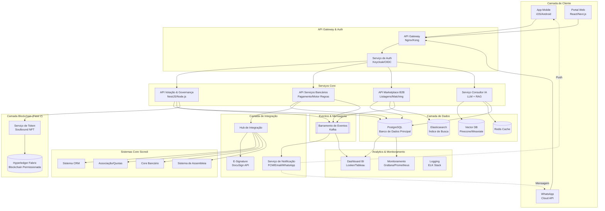

# Plataforma de Inovação Sicredi — Escopo do Projeto

## 📋 Estrutura do Documento

### Visão Geral das Seções
1. [**Resumo Executivo**](#1-resumo-executivo) — Visão e proposta de valor
2. [**Declaração do Problema**](#2-declaração-do-problema) — Pontos de dor a nível empresarial e do cliente
3. [**Soluções Propostas**](#3-soluções-propostas) — Três propostas principais com escopo detalhado
   - [**Proposta #1:** Sistema de Votação de Associados com Integração Blockchain](#31-proposta-1-sistema-de-votação-de-associados-com-integração-blockchain)
   - [**Proposta #2:** Melhorias na Experiência Bancária](#32-proposta-2-melhorias-na-experiência-bancária)
   - [**Proposta #3:** Hub B2B & Consultor Financeiro com IA](#33-proposta-3-hub-b2b--consultor-financeiro-com-ia)
4. [**Oportunidade de Mercado**](#4-oportunidade-de-mercado-tamsamsom) — Análise TAM/SAM/SOM para sistema de votação
5. [**Arquitetura**](#5-arquitetura-do-sistema) — Design do sistema e integrações
6. [**Roadmap de Implementação**](#6-roadmap-de-implementação) — POC, piloto e marcos mensais
7. [**Métricas de Sucesso**](#métricas-de-sucesso-poc--piloto) — KPIs para cada proposta
8. [**Gestão de Riscos**](#7-gestão-de-riscos) — Principais riscos e mitigações
9. [**Próximos Passos**](#8-próximos-passos--pontos-de-decisão) — Itens de ação e pontos de decisão

---

## 1. Resumo Executivo

O Sicredi pode transformar o engajamento dos associados e a agilidade operacional através de três inovações integradas:

1. **Sistema de Votação Democrática** — Dar voz a cada associado com votação ponderada por quotas e tokens de governança garantidos por blockchain
2. **Experiência Bancária Sem Atritos** — Eliminar pontos de fricção em cobrança, gestão de cartões e compra de quotas
3. **Efeitos de Rede entre Associados** — Conectar associados através de marketplace B2B e consultoria financeira com IA

### Visão
Criar uma plataforma cooperativa moderna onde:
- Associados se sintam ouvidos e valorizados através de tomada de decisão transparente e participativa
- Operações bancárias sejam fluidas e inteligentes
- A cooperativa se torne um ecossistema de negócios próspero para seus associados

---

## 2. Declaração do Problema

### 2.1 Desafios a Nível Empresarial

#### Principais Pontos de Dor:
- **Ciclos de Decisão Lentos:** Ideias levam semanas/meses para serem avaliadas e implementadas
- **Feedback Opaco:** Sugestões dos associados desaparecem em uma caixa preta
- **Autonomia Local Limitada:** Agências não conseguem testar inovações rapidamente
- **Dados Subutilizados:** Dados ricos dos associados não são usados para insights personalizados
- **Rede Fragmentada:** Associados não conhecem os serviços/expertise de outros associados

### 2.2 Pontos de Dor a Nível do Cliente (App Bancário)

#### Problemas Críticos:
1. **Inflexibilidade de Cobrança:** Associados não podem antecipar sua fatura do cartão de crédito mantendo o débito automático ativo para o saldo restante
2. **Lógica de Bloqueio de Cartão:** Cartões são bloqueados mesmo quando os associados têm saldo suficiente; desbloquear requer intervenção manual
3. **Fricção na Compra de Quotas:** Comprar quotas de capital requer:
   - Contatar um gerente (não está claro quem/como)
   - Assinatura manual de documentos
   - Processamento de vários dias
   - Nenhuma opção de autoatendimento digital
4. **Baixo Engajamento:** Tarefas simples requerem intervenção humana; sem orientação inteligente ou assistência de chatbot

---

## 3. Soluções Propostas

### 3.1 Proposta #1: Sistema de Votação de Associados com Integração Blockchain

#### Visão Geral
Uma plataforma de votação transparente e democrática que dá a cada associado Sicredi uma voz nas decisões cooperativas, ponderada por suas quotas e função, com registros de governança imutáveis protegidos por blockchain.

#### Proposta Central de Valor
- **Transparência:** Cada associado vê seu poder de voto, histórico de propostas e resultados das decisões
- **Reconhecimento:** Peso do voto reflete o investimento do associado (quotas) e expertise (função)
- **Engajamento Comunitário:** Transformar associados passivos em participantes ativos
- **Autenticidade Blockchain:** Trilha de auditoria imutável; posiciona o Sicredi como líder em inovação em cripto/Web3

#### Recursos Principais

**1. Gestão do Ciclo de Vida de Propostas**
- **Criar:** Qualquer associado pode submeter propostas de melhoria (produto, operações, serviços)
- **Discutir:** Threads de comentários, reações e período de refinamento (duração configurável)
- **Votar:** Votação ponderada com prazo claro e requisitos de quórum
- **Reportar:** Resultados transparentes com métricas de participação e status de implementação

**2. Mecanismo de Votação Ponderada**
- **Peso Baseado em Quotas:** Poder de voto proporcional às quotas de capital detidas
- **Modificadores de Função (Opcional):** Peso adicional para membros do conselho, associados de longa data ou especialistas no assunto
- **Configurável:** Administradores podem ajustar fórmulas de peso por tipo de proposta
- **Transparente:** Cada associado vê exatamente como os pesos são calculados

**3. Delegação de Voto**
- Associados podem delegar temporariamente poder de voto a associados confiáveis
- Útil para propostas técnicas complexas ou quando o associado está indisponível
- Delegação é revogável e limitada no tempo

**4. Integração Blockchain**
- **Fase 1 (POC):** Votação off-chain com assinaturas criptográficas e logs de auditoria
- **Fase 2 (Piloto):** Implantar **tokens de governança soulbound (não transferíveis)** em blockchain permissionada
  - Cada token codifica o peso de voto do associado
  - Atualizado automaticamente quando as quotas mudam
  - Registro de votação imutável para total transparência
  - Plataforma: Hyperledger Fabric ou Quorum (enterprise-grade, compatível com LGPD)

**5. Acesso Multicanal**
- **App Mobile:** Interface rica de votação com detalhes completos das propostas
- **WhatsApp:** Vote via comandos simples; receba notificações e resumos
- **Console Admin:** Gerencie propostas, configure políticas, monitore participação

#### Capacidades Administrativas
- Criar e gerenciar categorias de propostas (Produto, UX, Operações, Comunidade, etc.)
- Definir limites de quórum, períodos de votação e critérios de elegibilidade
- Monitorar métricas de participação em tempo real
- Exportar relatórios de auditoria para conformidade
- Moderar conteúdo e gerenciar prevenção de abuso

#### Benefícios
- **Para Associados:** Sentir-se ouvidos, reconhecidos e valorizados; influência transparente na direção da cooperativa
- **Para o Sicredi:** Ciclos de inovação mais rápidos; tomada de decisão baseada em dados; lealdade mais forte dos associados
- **Para Agências:** Testar iniciativas locais com validação dos associados antes do lançamento amplo
- **Para o Setor:** Posicionar o Sicredi como líder em FinTech democrático e governança Web3

---

### 3.2 Proposta #2: Melhorias na Experiência Bancária

#### Visão Geral
Eliminar pontos críticos de fricção no app bancário que frustram os associados e criam tickets de suporte desnecessários, focando em flexibilidade de cobrança, gestão inteligente de cartões e compras de quotas por autoatendimento.

#### Três Melhorias Principais

**1. Recurso "Antecipar & Manter Débito Automático"**

**Problema Atual:**
- Associados devem escolher entre antecipar sua fatura OU manter o débito automático ativo
- Se anteciparem, o débito automático é desativado e podem perder pagamentos futuros
- Isso cria complexidade desnecessária e reduz a adoção do débito automático

**Solução:**
- Habilitar **antecipação simultânea e débito automático ativo**
- Lógica de divisão de fatura: antecipação reduz o principal; débito automático cobre saldo restante na data de vencimento
- Motor de regras inteligente que lida com antecipações parciais de forma elegante

**Fluxo do Usuário:**
1. Associado abre fatura do cartão de crédito
2. Vê a opção: "Pague R$ [valor] agora e mantenha o débito automático para o resto"
3. Confirma antecipação
4. Sistema: divide fatura, processa antecipação imediatamente, agenda débito automático para o restante
5. Associado recebe confirmação mostrando ambas as transações

**2. Desbloqueio Inteligente de Cartão via Antecipação**

**Problema Atual:**
- Cartão é bloqueado mesmo quando o associado tem saldo suficiente na conta
- Desbloquear requer ligar para suporte ou visitar uma agência
- Regras parecem opacas e frustrantes

**Solução:**
- Regras claras e transparentes de bloqueio/desbloqueio exibidas no app
- **Desbloqueio instantâneo** quando o associado faz uma antecipação qualificada
- Notificações proativas antes do bloqueio do cartão com ação sugerida

**Fluxo do Usuário:**
1. Associado recebe notificação: "Seu cartão pode ser bloqueado devido a [motivo específico]. Pague R$ [valor] agora para evitar bloqueio."
2. Se bloqueado, app mostra: "Cartão bloqueado. Pague R$ [valor] para desbloquear imediatamente."
3. Pagamento com um toque do saldo disponível
4. Atualização instantânea de status; cartão reativado em segundos
5. Explicação clara do porque aconteceu e como prevenir bloqueios futuros

**3. Compra de Quotas com Um Clique (Capital Social)**

**Problema Atual:**
- Comprar quotas requer múltiplas etapas manuais ao longo de vários dias
- Associados não sabem quem contatar ou como começar
- Nenhuma opção digital de autoatendimento

**Solução:**
- **Fluxo digital sem fricções** para compra de quotas
- E-signature integrada (DocuSign/equivalente)
- Lançamento instantâneo na conta do associado
- Notificação ao gerente para acompanhamento se necessário

**Fluxo do Usuário:**
1. Associado toca em "Comprar Quotas" no app (posicionamento prominente)
2. Sistema mostra quotas atuais, benefícios e opções de compra
3. Associado seleciona valor a comprar
4. Verificação rápida de KYC (se necessário para conformidade)
5. Revisa termos e assina eletronicamente (e-signature)
6. Autorização de pagamento (do saldo da conta ou plano de parcelamento)
7. Confirmação instantânea; quotas lançadas na conta imediatamente
8. Recibo gerado; gerente notificado para acompanhamento de cortesia

#### Implementação Técnica
- **Motor de Regras:** Configuração flexível de políticas para lógica de cobrança, bloqueio e desbloqueio
- **Orquestração de Pagamentos:** Processamento de pagamentos em tempo real com tratamento de fallback
- **Integração E-Signature:** DocuSign, Adobe Sign ou equivalente brasileiro (valid.com.br)
- **Sistema de Notificações:** Notificações push, email e alertas WhatsApp
- **Analytics:** Rastrear taxas de conversão, pontos de desistência e pontuações de satisfação

#### Impacto Esperado
- **Redução de Tickets de Suporte:** -40% tickets relacionados a bloqueio de cartão e confusão de cobrança
- **Aumento em Compras de Quotas:** +30% taxa de conversão para compras de quotas
- **Maior Adoção de Débito Automático:** +25% associados usando débito automático
- **Satisfação do Cliente:** Pontuação CSAT ≥ 4,3/5 para esses recursos

---

### 3.3 Proposta #3: Hub B2B & Consultor Financeiro com IA

#### Visão Geral
Transformar o Sicredi de uma instituição financeira em um **ecossistema de negócios** conectando associados com serviços, expertise e oportunidades uns dos outros, impulsionado por um consultor IA inteligente acessível via app e WhatsApp.

#### Proposta Central de Valor
- **Efeitos de Rede:** Desbloquear o valor coletivo dos 9M de associados Sicredi
- **Comércio Associado-para-Associado:** Criar um marketplace confiável para serviços, empregos e parcerias
- **Assistência Inteligente:** Consultor financeiro com IA que desvia consultas rotineiras e apresenta oportunidades relevantes
- **Crescimento Econômico Local:** Fortalecer economias locais facilitando a colaboração entre associados

#### Componentes Principais

**1. Marketplace B2B**

**Recursos:**
- **Listagens de Serviços:** Associados podem oferecer serviços profissionais (contabilidade, jurídico, marketing, TI, construção, etc.)
- **Quadro de Empregos:** Publicar e descobrir oportunidades de emprego dentro da rede cooperativa
- **Solicitações de Parceria:** Encontrar parceiros de negócios para projetos, investimentos ou empreendimentos
- **Ofertas Especiais:** Descontos e ofertas exclusivas entre associados

**Descoberta & Correspondência:**
- **Busca Inteligente:** Filtrar por localização, indústria, expertise e reputação
- **Motor de Recomendação:** IA sugere serviços/oportunidades relevantes baseado no perfil e comportamento do associado
- **Sinais de Reputação:** Tempo no Sicredi, quotas detidas, credenciais verificadas, avaliações de pares
- **Perfis Verificados:** Sistema de emblemas para negócios e credenciais verificadas

**Confiança & Segurança:**
- Identidade de associado verificada pelo Sicredi
- Histórico de transações e avaliações (opcional)
- Processo de resolução de disputas
- Tratamento de dados conforme LGPD

**2. Chatbot Consultor Financeiro com IA**

**Capacidades:**
- **Respostas Alimentadas por RAG:** Geração aumentada por recuperação de políticas Sicredi, FAQs, documentação de produtos
- **Orientação Contextual:** Conselho personalizado baseado em dados da conta do associado, histórico de transações e objetivos declarados
- **Nudges de Próxima-Melhor-Ação:** Sugestões proativas (ex: "Você é elegível para uma taxa de empréstimo melhor" ou "Associados em sua área procuram [seu serviço]")
- **Transferência Humana:** Escalação perfeita para agentes humanos para questões complexas
- **Multi-idioma:** Português com dialetos regionais opcionais

**Casos de Uso:**
- "Como aumentar meu limite de crédito?"
- "Quais são os requisitos para um empréstimo imobiliário?"
- "Me conecte com um contador certificado na minha cidade"
- "Mostre-me oportunidades de investimento para R$ 50k"
- "Quando é a próxima assembleia?"

**Canais:**
- **Chat no App:** Interface rica com respostas rápidas, imagens e formulários
- **WhatsApp Business:** Interface conversacional usando Cloud API para acessibilidade em massa
- **Voz (Futuro):** Integração com assistentes de voz para acesso hands-free

**3. Dashboard de Analytics para Agências**

**Para Gerentes Locais:**
- **Necessidades dos Associados:** Quais serviços/empregos os associados estão procurando nesta região?
- **Lacunas de Oferta:** Quais serviços estão em demanda mas sub-ofertados localmente?
- **Métricas de Engajamento:** Quais associados são mais ativos no marketplace/consultor?
- **Alertas de Oportunidade:** Novas oportunidades de negócio que vale a pena destacar para associados específicos

**Benefícios:**
- **Para Associados:** Acesso à rede de negócios confiável; reduzir custos de busca; crescer receita
- **Para o Sicredi:** Maior retenção; novas fontes de receita (listagens premium, taxas de transação); diferenciação de bancos tradicionais
- **Para Agências:** Relacionamentos mais profundos com associados; insights locais baseados em dados; matching proativo de oportunidades
- **Para Suporte:** 25-40% deflexão de tickets; custos de suporte menores; tempos de resposta mais rápidos

#### Arquitetura Técnica
- **Plataforma Marketplace:** Backend Node.js/NestJS com PostgreSQL; busca via Elasticsearch
- **Stack de IA/LLM:** OpenAI GPT-4 ou Anthropic Claude com vector DB (Pinecone/Weaviate) para RAG
- **Integração WhatsApp:** Meta Cloud API com manipuladores webhook
- **Motor de Recomendação:** Filtragem colaborativa + recomendações baseadas em conteúdo
- **Analytics:** Rastreamento de eventos, dashboards (Looker/Tableau) e relatórios

#### Impacto Esperado
- **Deflexão de Tickets:** 25-40% redução em consultas de suporte rotineiras
- **Adoção do Marketplace:** 5-10% dos associados do piloto engajam com pelo menos uma listagem
- **Nova Receita:** Taxas de transação ou memberships premium (Fase 2)
- **Retenção de Associados:** +15% aumento em NPS entre usuários ativos do marketplace

---

## 4. Oportunidade de Mercado (TAM/SAM/SOM)

### Foco: Sistema de Votação & Governança Democrática

#### Mercado Endereçável Total (TAM)
**Setor de Cooperativas de Crédito Brasileiras**
- **Total de Associados:** ~19,2 milhões (em todas as cooperativas de crédito brasileiras)
- **Contexto de Mercado:** Cooperativas de crédito são o segmento de crescimento mais rápido nos serviços financeiros brasileiros
- **Adoção Digital:** 68% dos associados de cooperativas usam mobile banking (fonte: OCB 2023)
- **Necessidade de Governança:** Assembleias tradicionais têm <5% de participação; democracia digital pode transformar engajamento

**Cálculo do Tamanho de Mercado:**
- Assumir modelo de precificação SaaS: R$ 2-5 por associado ativo/mês para plataforma de votação
- TAM = 19,2M associados × R$ 3,50/mês × 12 meses = **R$ 806 milhões/ano**
- Receita adicional de consultoria de governança e serviços de integração blockchain

#### Mercado Endereçável Atendível (SAM)
**Sistema Cooperativo Sicredi**
- **Total de Associados:** ~9 milhões (47% do mercado cooperativo brasileiro)
- **Alcance Geográfico:** Presente em todos os estados brasileiros; mais forte no Sul e Sudeste
- **Maturidade Digital:** App mobile estabelecido com 6,5M+ usuários ativos
- **Ajuste Estratégico:** DNA cooperativo do Sicredi se alinha perfeitamente com ferramentas de governança democrática

**Cálculo do Tamanho de Mercado:**
- SAM = 9M associados × R$ 3,50/mês × 12 meses = **R$ 378 milhões/ano**
- Implantação de token de governança blockchain adiciona tier premium: estimado +40% receita
- **SAM Total:** ~**R$ 530 milhões/ano**

#### Mercado Atingível Atendível (SOM)
**Meta de Fase Piloto**
- **Escopo do Piloto:** 1-2 cooperativas Sicredi em regiões de alto engajamento
- **Associados Alvo:** ~50.000 associados ativamente engajados
- **Premissa de Engajamento:** 30% taxa de participação nos primeiros 6 meses (vs. 5% para assembleias tradicionais)

**Cálculo do Tamanho de Mercado:**
- SOM (Ano 1) = 50k associados × 30% engajamento × R$ 3,50/mês × 12 meses = **R$ 6,3 milhões/ano**

**Caminho de Escala (Projeção de 3 Anos):**
- **Ano 1 (Piloto):** 50k associados, 30% engajamento = R$ 6,3M receita
- **Ano 2 (Expansão Regional):** 500k associados, 25% engajamento = R$ 52,5M receita  
- **Ano 3 (Todo Sicredi):** 2M associados, 20% engajamento = R$ 168M receita

### Além da Votação: Potencial de Receita do Ecossistema

**Marketplace Hub B2B:**
- **Monetização:** 2-5% taxa de transação em transações do marketplace
- **Premissa:** 5% dos associados engajam; transação média R$ 2.000/ano
- **Receita (Ano 2):** 9M associados × 5% × R$ 2.000 × 3% taxa = **R$ 27M/ano**

**Tier Premium do Consultor IA:**
- **Monetização:** R$ 9,99/mês para recursos premium (analytics avançados, suporte prioritário)
- **Premissa:** 2% dos associados assinam
- **Receita (Ano 2):** 9M × 2% × R$ 9,99 × 12 = **R$ 21,6M/ano**

**Oportunidade Total do Ecossistema (Ano 3):**
- Plataforma de Votação: R$ 168M
- Marketplace B2B: R$ 27M
- Consultor IA Premium: R$ 21,6M
- **Total Combinado:** ~**R$ 217M/ano**

### Posicionamento Competitivo

**Principais Diferenciais:**
- **Vantagem de primeiro movimento** em governança democrática específica para cooperativas
- **Autenticidade blockchain** posiciona Sicredi como inovador Web3
- **Ecossistema integrado** (votação + banking + marketplace) cria altos custos de mudança
- **Alinhamento de DNA cooperativo** torna o Sicredi o terreno de prova ideal

**Panorama Competitivo:**
- **Ferramentas tradicionais de governança:** Decision Lens, Loomio (genérico; não focado em cooperativas)
- **Votação blockchain:** Vocdoni, Aragon (cripto-nativo; UX ruim para usuários mainstream)
- **Apps bancários:** Nubank, Inter (sem recursos de governança cooperativa)
- **Nossa vantagem:** Construído especificamente para cooperativas, com integração bancária e UX mainstream

---

## 5. Arquitetura do Sistema

### Diagrama de Arquitetura de Alto Nível

### Componentes da Arquitetura

#### 1. **Camada de Cliente**
- **App Mobile:** React Native para iOS/Android com capacidades offline-first
- **Portal Web:** Console admin Next.js para gestão e analytics
- **WhatsApp:** Integração Cloud API para votação conversacional e acesso ao consultor

#### 2. **API Gateway & Autenticação**
- **API Gateway:** Nginx ou Kong para roteamento, rate limiting e balanceamento de carga
- **Serviço de Auth:** Keycloak com OAuth2/OIDC; integração SSO com provedor de identidade Sicredi
- **Gestão de Sessão:** Tokens JWT com mecanismo de refresh; Redis para armazenamento de sessão

#### 3. **Microsserviços Core**

**API Votação & Governança:**
- Gestão de propostas (operações CRUD)
- Lógica de votação ponderada com fórmulas configuráveis
- Gestão de delegação
- Validação de quórum/limite
- Cálculo de resultados e trilha de auditoria

**API Serviços Bancários:**
- Motor de regras para lógica de cobrança/débito automático
- Workflows de bloqueio/desbloqueio de cartão
- Orquestração de compra de quotas
- Integração de processamento de pagamentos
- Histórico de transações e reconciliação

**API Marketplace B2B:**
- Gestão de listagens de serviços
- Busca e descoberta (Elasticsearch)
- Motor de recomendação
- Sistema de reputação
- Rastreamento de transações

**Serviço Consultor IA:**
- Integração LLM (OpenAI GPT-4 ou Claude)
- Pipeline RAG (geração aumentada por recuperação)
- Gestão de contexto para conversas
- Classificação de intenção
- Orquestração de transferência humana

#### 4. **Camada de Integração**
- **Hub de Integração:** Interface unificada para sistemas core Sicredi
- **E-Signature:** Integração DocuSign ou valid.com.br
- **Notificações:** Entrega multicanal (push, email, SMS, WhatsApp)
- **Webhooks:** Propagação de eventos em tempo real de sistemas core

#### 5. **Camada de Dados**
- **PostgreSQL:** Banco de dados primário para dados transacionais (propostas, votos, listagens, transações)
- **Vector DB:** Embeddings para consultor IA (políticas, FAQs, docs de produtos)
- **Redis:** Camada de cache para leituras de alta frequência (contagens de votos, perfis de associados)
- **Elasticsearch:** Busca full-text para marketplace e propostas

#### 6. **Streaming de Eventos**
- **Kafka:** Barramento de eventos para processamento assíncrono
  - Eventos de voto → gatilhos de notificação
  - Mudanças de quota → atualizações de token
  - Ações do marketplace → pipeline de analytics

#### 7. **Camada Blockchain (Fase 2)**
- **Serviço de Token:** Cunha e gerencia tokens de governança soulbound
- **Blockchain Permissionada:** Hyperledger Fabric ou Quorum
  - Tokens não transferíveis ligados ao ID do associado
  - Atualizações automáticas de peso em mudanças de quota
  - Registro de votação imutável

#### 8. **Analytics & Observabilidade**
- **Dashboards BI:** Analytics em tempo real para participação, tendências e métricas de negócio
- **Monitoramento:** Prometheus + Grafana para saúde do serviço, SLOs e alertas
- **Logging:** ELK stack (Elasticsearch, Logstash, Kibana) para logs centralizados
- **Tracing:** Jaeger ou Zipkin para rastreamento distribuído

### Stack Técnico

| Camada | Tecnologia |
|--------|-----------|
| **Frontend** | React Native (mobile), Next.js (web), TypeScript |
| **Backend** | Node.js (NestJS), TypeScript, REST + GraphQL |
| **Banco de Dados** | PostgreSQL 15, Redis 7, Elasticsearch 8 |
| **IA/ML** | OpenAI GPT-4, Pinecone/Weaviate, LangChain |
| **Mensageria** | Apache Kafka, RabbitMQ (fallback) |
| **Blockchain** | Hyperledger Fabric 2.x (Fase 2) |
| **Auth** | Keycloak, OAuth2/OIDC, JWT |
| **Armazenamento** | AWS S3 ou MinIO para documentos/exportações |
| **CDN** | Cloudflare ou AWS CloudFront |
| **Monitoramento** | Prometheus, Grafana, ELK, Sentry |
| **CI/CD** | GitHub Actions, Docker, Kubernetes |

### Segurança & Conformidade

- **Conformidade LGPD:** Minimização de dados, gestão de consentimento, direito ao esquecimento
- **Criptografia:** TLS 1.3 em trânsito; AES-256 em repouso
- **Controle de Acesso:** RBAC com princípio do menor privilégio
- **Logs de Auditoria:** Logs imutáveis para todas as operações críticas
- **Rate Limiting:** Prevenir abuso e DDoS; quotas por usuário
- **WAF:** Web Application Firewall para proteção contra ameaças
- **Testes de Penetração:** Auditorias de segurança trimestrais

---

## 6. Roadmap de Implementação

### Fase 0: Descoberta & Planejamento (2 Semanas)

**Semana 1: Alinhamento de Stakeholders**
- Reunião de kickoff com liderança Sicredi
- Definir cooperativa(s) piloto e associados alvo
- Fixar política de peso de votação (quotas + fórmulas de função)
- Estabelecer métricas de sucesso e OKRs
- Revisão de segurança e conformidade

**Semana 2: Fundação Técnica**
- Setup de ambiente (dev, staging, prod)
- Integração SSO com provedor de identidade Sicredi
- Design de schema do banco de dados core
- Contratos de API e documentação
- Setup de pipeline CI/CD

---

### Fase 1: POC (1 Semana) — Provar Valor Core

**Objetivo:** Demonstrar fluxo de votação end-to-end com propostas reais e analytics

**Dia 1: Fundações**
- Implantar infraestrutura básica (API gateway, auth, banco de dados)
- Semear 2 propostas reais com stakeholders Sicredi
- Definir critérios de sucesso com equipe piloto

**Dia 2: Experiência do Usuário**
- Construir protótipo de app mobile clicável (UI de votação)
- Implementar comandos de votação WhatsApp
- Integração SSO (stub se necessário)

**Dia 3: Lógica Core**
- API de votação com votos ponderados simulados
- Sistema de notificação (push + WhatsApp)
- Atualizações de contagem de votos em tempo real

**Dia 4: Analytics & Relatórios**
- Dashboard de participação para admins
- Relatórios exportáveis CSV/PDF
- Visualizador de log de auditoria

**Dia 5: Teste & Aprendizado**
- Teste interno com 20-50 funcionários Sicredi
- Coletar feedback e iterar
- Gerar relatório de aprendizados e recomendações para Fase 2

**Entregas do POC:**
- ✅ Fluxo de votação funcionando (app + WhatsApp)
- ✅ 2 ciclos de proposta completados
- ✅ Dashboard de analytics de participação
- ✅ Relatório de aprendizados com recomendações

---

### Fase 2: Piloto (1 Mês) — MVP Pronto para Produção

**Objetivo:** Lançar produção limitada com 1-2 cooperativas; integrar dados reais; validar product-market fit

---

#### **Semana 1: Fundação MVP & Correções Bancárias**

**Foco:** Integração de dados reais; melhorias core da experiência bancária

**Sistema de Votação:**
- Integrar com dados reais de associação e quotas
- Implementar fórmulas reais de votação ponderada
- Adicionar categorias de propostas e moderação
- Feature flags para lançamento gradual
- Logging de auditoria abrangente

**Experiência Bancária:**
- Construir motor de regras "Antecipar & manter débito automático"
- Implementar fluxo de desbloqueio de cartão via antecipação
- Criar UI de compra de quotas com um clique
- Integrar serviço de e-signature (DocuSign/valid.com.br)
- Camada de orquestração de pagamentos

**Infraestrutura:**
- Hardening de ambiente de produção
- Backups de banco de dados e recuperação de desastres
- Setup de monitoramento e alertas
- Teste de carga (simular 10k usuários concorrentes)

**Entregas:**
- ✅ Plataforma de votação pronta para produção com dados reais de associados
- ✅ Recurso "Antecipar & manter débito automático" ao vivo
- ✅ Desbloqueio inteligente de cartão operacional
- ✅ MVP de compra de quotas (sem blockchain ainda)

---

#### **Semana 2: Governança & Engajamento**

**Foco:** Recursos avançados de votação; kickstart do marketplace B2B

**Sistema de Votação:**
- Funcionalidade de delegação de voto
- Políticas de quórum e limites
- Console admin para gestão de propostas
- Métricas de engajamento e dashboards
- Lembretes automatizados (app + WhatsApp)

**Hub B2B:**
- CRUD básico de listagens do marketplace
- Funcionalidade de busca (Elasticsearch)
- Verificação de perfil de associado
- Algoritmo simples de matching

**Consultor IA:**
- Pipeline RAG com FAQs e políticas Sicredi
- Classificação de intenção para consultas comuns
- Interface conversacional WhatsApp
- Workflow de transferência humana

**Entregas:**
- ✅ Recursos de delegação e quórum ao vivo
- ✅ Marketplace B2B básico com 20+ listagens seed
- ✅ Consultor IA respondendo top 20 tópicos de FAQ
- ✅ Fluxos WhatsApp totalmente funcionais

---

#### **Semana 3: Tokens & Confiança**

**Foco:** Integração blockchain; marketplace avançado; conclusão da compra de quotas

**Tokens de Governança:**
- Projetar smart contracts de token soulbound
- Implantar em testnet Hyperledger Fabric
- Serviço de cunhagem de token (ligado ao ID do associado)
- Atualizações automáticas de peso em mudanças de quota
- **OU** finalizar ledger assinado off-chain se blockchain atrasado

**Experiência Bancária:**
- Completar compra de quotas com e-signature
- Sistema de notificação de gerente
- Geração de recibo e histórico
- Opções de pagamento parcelado

**Marketplace:**
- Motor de recomendação (filtragem colaborativa)
- Sistema de reputação (baseado em tempo, quotas, avaliações)
- Dashboard de analytics de agências (insights demanda/oferta)
- Busca aprimorada com filtros (localização, indústria, preço)

**Entregas:**
- ✅ Tokens de governança implantados (testnet ou produção)
- ✅ Fluxo completo de compra de quotas com e-signature
- ✅ Marketplace com recomendações e reputação
- ✅ Dashboard de insights de agências

---

#### **Semana 4: Hardening & Lançamento do Piloto**

**Foco:** Segurança, conformidade e lançamento piloto com associados reais

**Segurança & Conformidade:**
- DPIA (Avaliação de Impacto de Proteção de Dados) para LGPD
- Rate limiting e prevenção de abuso
- Testes de penetração e varredura de vulnerabilidades
- Plano de resposta a incidentes
- Gestão de consentimento LGPD

**Otimização:**
- Ajuste de performance (tempos de resposta API <200ms)
- Setup de testes A/B para fluxos chave
- Instrumentação de telemetria e analytics
- Procedimentos de rollback e kill switches de features

**Lançamento do Piloto:**
- Lançamento gradual para 1-2 cooperativas piloto
- Fluxo de onboarding para primeiros 1.000 associados
- Monitoramento e suporte diário
- Atualizações semanais de stakeholders
- Coleta de feedback de associados

**Atividades de Fim de Mês:**
- Análise de resultados do piloto
- Revisão de métricas de sucesso vs. OKRs
- Documentação de lições aprendidas
- Roadmap para expansão regional

**Entregas:**
- ✅ Auditoria de segurança aprovada
- ✅ Conformidade LGPD validada
- ✅ 1.000+ associados piloto onboarded
- ✅ Relatório de sucesso com métricas e recomendações

---

### Métricas de Sucesso (POC → Piloto)

| Métrica | Meta POC | Meta Piloto |
|---------|----------|-------------|
| **Participação em Votação** | 50% (interno) | ≥20% (associados) |
| **Tempo: Ideia → Decisão** | N/A | ≤7 dias |
| **Tickets Bloqueio Cartão** | N/A | -40% redução |
| **Conversão Compra Quotas** | N/A | +30% aumento |
| **Adoção Débito Automático** | N/A | +25% aumento |
| **Deflexão Tickets (IA)** | N/A | ≥25% |
| **Ações Marketplace** | N/A | ≥5% dos associados |
| **Pontuação CSAT** | N/A | ≥4,3/5 |
| **Taxa de Crash do App** | <1% | <0,5% |
| **Latência P95 da API** | <500ms | <200ms |

---

### Fase 3: Escala (Meses 2-6) — Expansão Regional

**Mês 2-3: Lançamento Regional**
- Expandir para 5-10 cooperativas adicionais
- Meta: 500k associados, 25% engajamento
- Introduzir recursos premium do marketplace (taxas de transação, emblemas verificados)
- Lançar tier premium do consultor IA (R$ 9,99/mês)

**Mês 4-5: Expansão de Recursos**
- Propostas e debates em vídeo
- Votação multi-sig para decisões de alto risco
- Integração com assembleias físicas (votação híbrida)
- Suite de gestão de quotas mobile-first

**Mês 6: Preparação Nacional**
- Escalar infraestrutura para 2M+ associados
- Potencial white-label para outras cooperativas brasileiras
- Lançamento de produção de token de governança (se pronto)
- Preparar para lançamento em todo Sicredi

---

## 7. Gestão de Riscos

### Principais Riscos & Estratégias de Mitigação

| Categoria de Risco | Risco Específico | Impacto | Probabilidade | Estratégia de Mitigação |
|-------------------|------------------|---------|---------------|------------------------|
| **Privacidade & Conformidade** | Violações LGPD; má manipulação de dados de associados | **Alto** | Médio | • Conduzir DPIA antes do lançamento piloto • Minimização de dados por design • Fluxos de consentimento explícito • Logs de auditoria imutáveis • Auditorias de conformidade regulares • Workflows de direito ao esquecimento |
| **Segurança** | Violação de dados; acesso não autorizado; ataques DDoS | **Alto** | Médio | • Testes de penetração trimestrais • WAF e proteção DDoS • RBAC com menor privilégio • Criptografia em repouso e em trânsito • Rate limiting por usuário/endpoint • Monitoramento SOC 24/7 |
| **Fraude & Abuso** | Manipulação de votos; propostas falsas; ataques de bots | **Alto** | Médio | • Limites de taxa em votos/propostas • Detecção de anomalias (padrões incomuns de votação) • Fila de moderação para propostas • Revisão humana para votos de alto risco • CAPTCHA para atividade suspeita • Throttling baseado em reputação |
| **Técnico** | Downtime do sistema; perda de dados; problemas de performance | **Alto** | Baixo | • SLA de 99,9% com redundância • Replicação de banco de dados multi-AZ • Backups diários com recuperação point-in-time • Teste de carga antes do lançamento • Circuit breakers e fallbacks • Estratégia de deployment blue-green |
| **Integração** | Atrasos na integração com sistemas core Sicredi | **Médio** | Alto | • Usar simuladores/stubs em POC • Paralelizar trabalho de integração • Feature flags para degradação graceful • Arquitetura async orientada a eventos • Contratos de API bem definidos antecipadamente |
| **Governança** | Disputas de política de peso de voto; baixa participação | **Médio** | Médio | • Começar com fórmulas simples e transparentes • Documentar todas as políticas claramente • Campanhas de educação de associados • Iterar baseado em feedback • Semear propostas convincentes • Gamificação e incentivos |
| **Adoção** | Baixo engajamento de associados; aumento de tickets de suporte | **Médio** | Médio | • Semear propostas de alto valor (melhorias de produto que associados se importam) • Recrutar champions de agências • Lembretes e nudges WhatsApp • Recompensas para early adopters • UX intuitiva com fricção mínima • Suporte 24/7 durante piloto |
| **Blockchain** | Bugs em smart contracts; instabilidade da rede | **Baixo** | Baixo | • Validação extensiva em testnet • Verificação formal de contratos • Começar com ledger off-chain (fallback) • Lançamento blockchain faseado • Auditoria por firma de segurança blockchain |
| **IA/LLM** | Alucinações; respostas enviesadas; vazamento de dados | **Médio** | Médio | • RAG com base de conhecimento curada • Validação e filtragem de output • Human-in-the-loop para consultas sensíveis • Fine-tuning regular do modelo • Disclaimers claros sobre limitações da IA • Prevenção de injeção de prompt |
| **Operacional** | Lacunas de habilidades da equipe; dependência de fornecedor | **Baixo** | Baixo | • Programas de treinamento para equipe Sicredi • Sessões de transferência de conhecimento • Documentação abrangente • Estratégia multi-fornecedor (evitar lock-in) • Open-source onde possível |

### Plano de Monitoramento de Riscos

**Semanal (Durante Piloto):**
- Revisar incidentes de segurança e anomalias
- Verificar métricas de performance do sistema (SLOs)
- Monitorar taxas de adoção e engajamento
- Triar tickets de suporte para padrões

**Mensal:**
- Revisão de conformidade (LGPD, logs de auditoria)
- Reuniões de avaliação de riscos com stakeholders
- Atualizar registro de riscos baseado em aprendizados
- Ajustar estratégias de mitigação conforme necessário

**Trimestral:**
- Auditoria externa de segurança
- Revisão e atualização de DPIA
- Drill de recuperação de desastres
- Revisão de performance de fornecedores

---

## 8. Próximos Passos & Pontos de Decisão

### Ações Imediatas (Próximas 2 Semanas)

#### 🎯 Decisões Estratégicas Necessárias
- [ ] **Aprovar Escopo:** Confirmar quais propostas incluir em POC/piloto (todas três ou priorizar?)
- [ ] **Selecionar Cooperativas Piloto:** Identificar 1-2 cooperativas com alta adoção digital e liderança engajada
- [ ] **Definir Política de Peso de Voto:** Fixar fórmula para votação baseada em quotas (método de cálculo exato)
- [ ] **Definir Limites de Quórum:** Definir participação mínima para propostas válidas
- [ ] **Aprovação de Orçamento:** Confirmar funding para POC (R$ 50k-R$ 100k) e piloto (R$ 300k-R$ 500k)

#### 🔐 Acessos & Permissões
- [ ] **Ambiente de Desenvolvimento:** Fornecer acesso aos ambientes dev/staging Sicredi
- [ ] **Integração SSO:** Compartilhar documentação do provedor de identidade e credenciais de teste
- [ ] **APIs de Sistema Core:** Conceder acesso API a sistemas de associação, quotas, CRM
- [ ] **Provedor E-Signature:** Selecionar e provisionar conta DocuSign/valid.com.br
- [ ] **WhatsApp Business:** Configurar conta Meta Cloud API e verificar número de telefone

#### 👥 Equipe & Governança
- [ ] **Nomear Squad Core:** Atribuir product owner Sicredi, tech lead e 2-3 stakeholders
- [ ] **Identificar Champions de Agências:** Recrutar 2-3 gerentes de agência para semear propostas e impulsionar adoção
- [ ] **Revisão Jurídica/Conformidade:** Engajar equipe jurídica para kickoff LGPD/DPIA
- [ ] **Envolvimento da Equipe de Segurança:** Briefar equipe de segurança sobre arquitetura e obter aprovação

#### 📊 Critérios de Sucesso
- [ ] **Definir OKRs:** Fixar métricas específicas de sucesso para POC e piloto (ex: "20% participação em 30 dias")
- [ ] **Cadência de Reportes:** Acordar formato de atualização de stakeholders semanal/quinzenal
- [ ] **Critérios Go/No-Go:** Definir condições para prosseguir de POC para piloto para escala

### Cronograma & Marcos

| Fase | Duração | Data Início | Entrega Chave |
|------|---------|-------------|---------------|
| **Descoberta & Planejamento** | 2 semanas | A definir | Setup ambiente, contratos API, plano piloto |
| **POC** | 1 semana | Semana 3 | Fluxo de votação funcionando, analytics, teste interno |
| **Revisão POC** | 3 dias | Fim Semana 3 | Decisão go/no-go para piloto |
| **Piloto (Mês 1)** | 4 semanas | Semana 4 | Plataforma pronta para produção com 1k+ associados |
| **Revisão Piloto** | 1 semana | Semana 8 | Relatório de sucesso, plano expansão regional |
| **Expansão Regional** | 3-6 meses | Mês 3+ | Escalar para 500k-2M associados |

### Questões Chave a Abordar Antes do Kickoff

1. **Política de Votação:**
   - Fórmula exata para poder de voto baseado em quotas (linear? logarítmica? limitada?)
   - Membros do conselho devem ter peso extra? Se sim, quanto?
   - Quais tipos de propostas os associados podem submeter? (produto, operações, comunidade, todos?)

2. **Recursos Bancários:**
   - Qual recurso bancário tem maior prioridade: antecipar+débito automático, desbloquear cartão ou compra de quotas?
   - Existem motores de regras existentes que devemos integrar ou construir do zero?
   - Quais limites de pagamento se aplicam a desbloqueio instantâneo/compras de quotas?

3. **Hub B2B:**
   - Devemos cobrar taxas de transação no piloto ou manter gratuito para impulsionar adoção?
   - Em quais categorias de serviços devemos focar inicialmente?
   - Devemos verificar credenciais de negócio ou começar apenas com associação Sicredi como requisito?

4. **Blockchain:**
   - Blockchain é necessário para piloto ou podemos começar off-chain e adicionar depois?
   - Se blockchain, Sicredi tem fornecedor/plataforma preferida?
   - Qual o apetite para ser a primeira cooperativa brasileira com tokens de governança?

5. **Suporte & Operações:**
   - Quem trata tickets de suporte do piloto: equipe Sicredi ou fornecedor externo?
   - Qual SLA estamos mirando para tempos de resposta?
   - Como tratamos escalações durante o piloto?

### Plano de Comunicação

**Stakeholders Internos:**
- Stand-ups semanais com squad core
- Atualizações quinzenais de comitê diretor (execs, jurídico, segurança)
- Apresentações mensais all-hands para equipes mais amplas Sicredi

**Associados Piloto:**
- Webinar pré-lançamento explicando sistema de votação (1 semana antes do piloto)
- Dicas diárias no WhatsApp durante primeira semana
- Newsletter semanal por email com stats de engajamento
- Notificações in-app para marcos chave

**Pós-Piloto:**
- Relatório público de sucesso (dados anonimizados)
- Case study para setor cooperativo brasileiro
- Oportunidades de palestras em conferências fintech/cooperativas

---

## 9. Apêndice: Análise Competitiva

### Competidores Diretos (Plataformas de Governança)

| Plataforma | Forças | Fraquezas | Nossa Vantagem |
|------------|--------|-----------|----------------|
| **Decision Lens** | Enterprise-grade, metodologia AHP comprovada | Caro, complexo, não específico para cooperativas | Melhor UX, integração WhatsApp, foco cooperativo |
| **Loomio** | Open-source, bom para pequenos grupos | Não escala para milhões, sem ponderação de quotas | Confiança blockchain, integração bancária |
| **Aragon** | Blockchain-nativo, tooling DAO | UX cripto-nativa, sem adoção mainstream | UX mainstream, blockchain permissionada, app bancário |
| **Snapshot** | Popular no Web3, votação sem gas | Sem verificação de identidade, sem recursos cooperativos | Identidade real, ponderação de quotas, conformidade |

### Competidores Indiretos (Apps Bancários)

| Banco | Inovação | Lacuna que Preenchemos |
|-------|----------|------------------------|
| **Nubank** | UX de melhor classe, chatbot IA | Sem governança cooperativa, sem rede B2B |
| **Inter** | Estratégia super app, marketplace | Sem votação, sem conceito de quotas |
| **C6 Bank** | Stack tecnológico moderno | Sem DNA cooperativo, sem democracia de associados |
| **Sicredi (atual)** | Valores cooperativos, marca confiável | Necessita plataforma democrática, UX moderna, ecossistema |

---

## 10. Conclusão

Esta proposta delineia uma oportunidade transformadora para o Sicredi de:

✅ **Liderar o setor cooperativo** em inovação democrática com votação apoiada por blockchain  
✅ **Resolver problemas críticos de UX bancária** que frustram associados diariamente  
✅ **Desbloquear efeitos de rede** através de marketplace B2B e consultor IA  
✅ **Gerar novas fontes de receita** (SaaS, taxas de transação, recursos premium)  
✅ **Fortalecer lealdade de associados** através de transparência, reconhecimento e comunidade

**O caminho à frente está claro:**
1. Executar um **POC de 1 semana** para provar valor core com risco mínimo
2. Lançar um **piloto de 1 mês** com 1-2 cooperativas para validar product-market fit
3. Escalar para **9M associados Sicredi** ao longo de 6-12 meses
4. Oferecer como **solução white-label** para todas as cooperativas brasileiras (TAM: 19,2M associados)

**Oportunidade endereçável total:** R$ 530M/ano (votação + marketplace + consultor IA)

**Próximo passo:** Agendar reunião de kickoff para alinhar escopo, selecionar cooperativas piloto e fixar métricas de sucesso.

---

*Documento preparado pela Equipe Shippit para Sicredi. Última atualização: Outubro 2025*
*Este documento é intencionalmente conciso e modular para permitir iteração rápida com stakeholders.*

