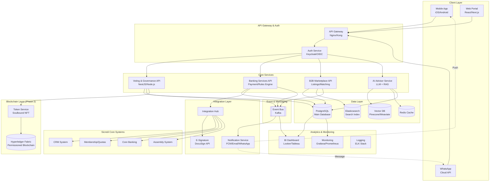

# Plataforma de Inovação Sicredi — Escopo do Projeto

## 📋 Estrutura do Documento

### Visão Geral das Seções
1. [**Resumo Executivo**](#1-resumo-executivo) — Visão e proposta de valor
2. [**Declaração do Problema**](#2-declaração-do-problema) — Pontos de dor a nível empresarial e do cliente
3. [**Soluções Propostas**](#3-soluções-propostas) — Três propostas principais com escopo detalhado
   - [**Proposta #1:** Sistema de Votação de Associados com Integração Blockchain](#31-proposta-1-sistema-de-votação-de-associados-com-integração-blockchain)
   - [**Proposta #2:** Melhorias na Experiência Bancária](#32-proposta-2-melhorias-na-experiência-bancária)
   - [**Proposta #3:** Hub B2B & Consultor Financeiro com IA](#33-proposta-3-hub-b2b--consultor-financeiro-com-ia)
4. [**Oportunidade de Mercado**](#4-oportunidade-de-mercado-tamsamsom) — Análise TAM/SAM/SOM para sistema de votação
5. [**Arquitetura**](#5-arquitetura-do-sistema) — Design do sistema e integrações
6. [**Roadmap de Implementação**](#6-roadmap-de-implementação) — POC, piloto e marcos mensais
7. [**Métricas de Sucesso**](#métricas-de-sucesso-poc--piloto) — KPIs para cada proposta
8. [**Gestão de Riscos**](#7-gestão-de-riscos) — Principais riscos e mitigações
9. [**Próximos Passos**](#8-próximos-passos--pontos-de-decisão) — Itens de ação e pontos de decisão

---

## 1. Resumo Executivo

O Sicredi pode transformar o engajamento dos associados e a agilidade operacional através de três inovações integradas:

1. **Sistema de Votação Democrática** — Dar voz a cada associado com votação ponderada por quotas e tokens de governança garantidos por blockchain
2. **Experiência Bancária Sem Atritos** — Eliminar pontos de fricção em cobrança, gestão de cartões e compra de quotas
3. **Efeitos de Rede entre Associados** — Conectar associados através de marketplace B2B e consultoria financeira com IA

### Visão
Criar uma plataforma cooperativa moderna onde:
- Associados se sintam ouvidos e valorizados através de tomada de decisão transparente e participativa
- Operações bancárias sejam fluidas e inteligentes
- A cooperativa se torne um ecossistema de negócios próspero para seus associados

---

## 2. Declaração do Problema

### 2.1 Desafios a Nível Empresarial

#### Principais Pontos de Dor:
- **Ciclos de Decisão Lentos:** Ideias levam semanas/meses para serem avaliadas e implementadas
- **Feedback Opaco:** Sugestões dos associados desaparecem em uma caixa preta
- **Autonomia Local Limitada:** Agências não conseguem testar inovações rapidamente
- **Dados Subutilizados:** Dados ricos dos associados não são usados para insights personalizados
- **Rede Fragmentada:** Associados não conhecem os serviços/expertise de outros associados

### 2.2 Pontos de Dor a Nível do Cliente (App Bancário)

#### Problemas Críticos:
1. **Inflexibilidade de Cobrança:** Associados não podem antecipar sua fatura do cartão de crédito mantendo o débito automático ativo para o saldo restante
2. **Lógica de Bloqueio de Cartão:** Cartões são bloqueados mesmo quando os associados têm saldo suficiente; desbloquear requer intervenção manual
3. **Fricção na Compra de Quotas:** Comprar quotas de capital requer:
   - Contatar um gerente (não está claro quem/como)
   - Assinatura manual de documentos
   - Processamento de vários dias
   - Nenhuma opção de autoatendimento digital
4. **Baixo Engajamento:** Tarefas simples requerem intervenção humana; sem orientação inteligente ou assistência de chatbot

---

## 3. Soluções Propostas

### 3.1 Proposta #1: Sistema de Votação de Associados com Integração Blockchain

#### Visão Geral
Uma plataforma de votação transparente e democrática que dá a cada associado Sicredi uma voz nas decisões cooperativas, ponderada por suas quotas e função, com registros de governança imutáveis protegidos por blockchain.

#### Proposta Central de Valor
- **Transparência:** Cada associado vê seu poder de voto, histórico de propostas e resultados das decisões
- **Reconhecimento:** Peso do voto reflete o investimento do associado (quotas) e expertise (função)
- **Engajamento Comunitário:** Transformar associados passivos em participantes ativos
- **Autenticidade Blockchain:** Trilha de auditoria imutável; posiciona o Sicredi como líder em inovação em cripto/Web3

#### Recursos Principais

**1. Gestão do Ciclo de Vida de Propostas**
- **Criar:** Qualquer associado pode submeter propostas de melhoria (produto, operações, serviços)
- **Discutir:** Threads de comentários, reações e período de refinamento (duração configurável)
- **Votar:** Votação ponderada com prazo claro e requisitos de quórum
- **Reportar:** Resultados transparentes com métricas de participação e status de implementação

**2. Mecanismo de Votação Ponderada**
- **Peso Baseado em Quotas:** Poder de voto proporcional às quotas de capital detidas
- **Modificadores de Função (Opcional):** Peso adicional para membros do conselho, associados de longa data ou especialistas no assunto
- **Configurável:** Administradores podem ajustar fórmulas de peso por tipo de proposta
- **Transparente:** Cada associado vê exatamente como os pesos são calculados

**3. Delegação de Voto**
- Associados podem delegar temporariamente poder de voto a associados confiáveis
- Útil para propostas técnicas complexas ou quando o associado está indisponível
- Delegação é revogável e limitada no tempo

**4. Integração Blockchain**
- **Fase 1 (POC):** Votação off-chain com assinaturas criptográficas e logs de auditoria
- **Fase 2 (Piloto):** Implantar **tokens de governança soulbound (não transferíveis)** em blockchain permissionada
  - Cada token codifica o peso de voto do associado
  - Atualizado automaticamente quando as quotas mudam
  - Registro de votação imutável para total transparência
  - Plataforma: Hyperledger Fabric ou Quorum (enterprise-grade, compatível com LGPD)

**5. Acesso Multicanal**
- **App Mobile:** Interface rica de votação com detalhes completos das propostas
- **WhatsApp:** Vote via comandos simples; receba notificações e resumos
- **Console Admin:** Gerencie propostas, configure políticas, monitore participação

#### Capacidades Administrativas
- Criar e gerenciar categorias de propostas (Produto, UX, Operações, Comunidade, etc.)
- Definir limites de quórum, períodos de votação e critérios de elegibilidade
- Monitorar métricas de participação em tempo real
- Exportar relatórios de auditoria para conformidade
- Moderar conteúdo e gerenciar prevenção de abuso

#### Benefícios
- **Para Associados:** Sentir-se ouvidos, reconhecidos e valorizados; influência transparente na direção da cooperativa
- **Para o Sicredi:** Ciclos de inovação mais rápidos; tomada de decisão baseada em dados; lealdade mais forte dos associados
- **Para Agências:** Testar iniciativas locais com validação dos associados antes do lançamento amplo
- **Para o Setor:** Posicionar o Sicredi como líder em FinTech democrático e governança Web3

---

### 3.2 Proposal #2: Banking Experience Enhancements

#### Overview
Eliminate critical friction points in the banking app that frustrate members and create unnecessary support tickets, focusing on billing flexibility, intelligent card management, and self-service quota purchases.

#### Three Core Improvements

**1. "Prepay & Keep Autopay" Feature**

**Current Problem:**
- Members must choose between prepaying their invoice OR keeping autopay active
- If they prepay, autopay is disabled, and they might miss future payments
- This creates unnecessary complexity and reduces autopay adoption

**Solution:**
- Enable **simultaneous prepayment and active autopay**
- Split invoice logic: prepayment reduces principal; autopay covers remaining balance on due date
- Intelligent rules engine that handles partial prepayments gracefully

**User Flow:**
1. Member opens credit card invoice
2. Sees option: "Pay R$ [amount] now and keep autopay for the rest"
3. Confirms prepayment
4. System: splits invoice, processes prepayment immediately, schedules autopay for remainder
5. Member receives confirmation showing both transactions

**2. Smart Card Unblocking via Prepayment**

**Current Problem:**
- Card gets blocked even when member has sufficient account balance
- Unblocking requires calling support or visiting an agency
- Rules feel opaque and frustrating

**Solution:**
- Clear, transparent blocking/unblocking rules displayed in app
- **Instant unblock** when member makes qualifying prepayment
- Proactive notifications before card block with suggested action

**User Flow:**
1. Member receives notification: "Your card may be blocked due to [specific reason]. Pay R$ [amount] now to prevent blocking."
2. If blocked, app shows: "Card blocked. Pay R$ [amount] to unblock immediately."
3. One-tap payment from available balance
4. Instant status update; card reactivated within seconds
5. Clear explanation of why it happened and how to prevent future blocks

**3. One-Click Quota Purchase (Capital Social)**

**Current Problem:**
- Buying quotas requires multiple manual steps over several days
- Members don't know who to contact or how to start
- No digital, self-service option

**Solution:**
- **Frictionless digital flow** for quota purchases
- Integrated e-signature (DocuSign/equivalent)
- Instant posting to member's account
- Manager notification for follow-up if needed

**User Flow:**
1. Member taps "Buy Quotas" in app (prominent placement)
2. System shows current quota holdings, benefits, and purchase options
3. Member selects amount to purchase
4. Quick KYC verification (if needed for compliance)
5. Reviews terms and signs electronically (e-signature)
6. Payment authorization (from account balance or installment plan)
7. Instant confirmation; quotas posted to account immediately
8. Receipt generated; manager notified for courtesy follow-up

#### Technical Implementation
- **Rules Engine:** Flexible policy configuration for billing, blocking, and unblocking logic
- **Payment Orchestration:** Real-time payment processing with fallback handling
- **E-Signature Integration:** DocuSign, Adobe Sign, or Brazilian equivalent (valid.com.br)
- **Notification System:** Push notifications, email, and WhatsApp alerts
- **Analytics:** Track conversion rates, drop-off points, and satisfaction scores

#### Expected Impact
- **Reduced Support Tickets:** -40% tickets related to card blocking and billing confusion
- **Increased Quota Purchases:** +30% conversion rate for quota purchases
- **Higher Autopay Adoption:** +25% members using autopay
- **Customer Satisfaction:** CSAT score ≥ 4.3/5 for these features

---

### 3.3 Proposal #3: B2B Hub & AI Financial Advisor

#### Overview
Transform Sicredi from a financial institution into a **business ecosystem** by connecting members with each other's services, expertise, and opportunities, powered by an intelligent AI advisor accessible via app and WhatsApp.

#### Core Value Proposition
- **Network Effects:** Unlock the collective value of 9M Sicredi members
- **Member-to-Member Commerce:** Create a trusted marketplace for services, jobs, and partnerships
- **Intelligent Assistance:** AI-powered financial advisor that deflects routine queries and surfaces relevant opportunities
- **Local Economic Growth:** Strengthen local economies by facilitating member collaboration

#### Key Components

**1. B2B Marketplace**

**Features:**
- **Service Listings:** Members can offer professional services (accounting, legal, marketing, IT, construction, etc.)
- **Job Board:** Post and discover employment opportunities within the cooperative network
- **Partnership Requests:** Find business partners for projects, investments, or ventures
- **Special Offers:** Exclusive member-to-member discounts and deals

**Discovery & Matching:**
- **Smart Search:** Filter by location, industry, expertise, and reputation
- **Recommendation Engine:** AI suggests relevant services/opportunities based on member profile and behavior
- **Reputation Signals:** Tenure with Sicredi, quotas held, verified credentials, peer ratings
- **Verified Profiles:** Badge system for verified businesses and credentials

**Trust & Safety:**
- Sicredi-verified member identity
- Transaction history and ratings (optional)
- Dispute resolution process
- LGPD-compliant data handling

**2. AI Financial Advisor Chatbot**

**Capabilities:**
- **RAG-Powered Responses:** Retrieval-augmented generation from Sicredi policies, FAQs, product documentation
- **Contextual Guidance:** Personalized advice based on member's account data, transaction history, and stated goals
- **Next-Best-Action Nudges:** Proactive suggestions (e.g., "You're eligible for a better loan rate" or "Members in your area are looking for [your service]")
- **Human Handoff:** Seamless escalation to human agents for complex issues
- **Multi-Language:** Portuguese with optional regional dialects

**Use Cases:**
- "How do I increase my credit limit?"
- "What are the requirements for a home loan?"
- "Connect me with a certified accountant in my city"
- "Show me investment opportunities for R$ 50k"
- "When is the next assembly meeting?"

**Channels:**
- **In-App Chat:** Rich interface with quick replies, images, and forms
- **WhatsApp Business:** Conversational interface using Cloud API for mass accessibility
- **Voice (Future):** Integration with voice assistants for hands-free access

**3. Agency Analytics Dashboard**

**For Local Managers:**
- **Member Needs:** What services/jobs are members searching for in this region?
- **Supply Gaps:** Which services are in demand but under-supplied locally?
- **Engagement Metrics:** Which members are most active in marketplace/advisor?
- **Opportunity Alerts:** New business opportunities worth highlighting to specific members

**Benefits:**
- **For Members:** Access to trusted business network; reduce search costs; grow revenue
- **For Sicredi:** Increased stickiness; new revenue streams (premium listings, transaction fees); differentiation from traditional banks
- **For Agencies:** Deeper member relationships; data-driven local insights; proactive opportunity matching
- **For Support:** 25-40% ticket deflection; lower support costs; faster response times

#### Technical Architecture
- **Marketplace Platform:** Node.js/NestJS backend with PostgreSQL; search via Elasticsearch
- **AI/LLM Stack:** OpenAI GPT-4 or Anthropic Claude with vector DB (Pinecone/Weaviate) for RAG
- **WhatsApp Integration:** Meta Cloud API with webhook handlers
- **Recommendation Engine:** Collaborative filtering + content-based recommendations
- **Analytics:** Event tracking, dashboards (Looker/Tableau), and reporting

#### Expected Impact
- **Ticket Deflection:** 25-40% reduction in routine support queries
- **Marketplace Adoption:** 5-10% of pilot members engage with at least one listing
- **New Revenue:** Transaction fees or premium memberships (Phase 2)
- **Member Retention:** +15% NPS increase among active marketplace users

---

## 4. Market Opportunity (TAM/SAM/SOM)

### Focus: Voting System & Democratic Governance

#### Total Addressable Market (TAM)
**Brazilian Credit Cooperative Sector**
- **Total Members:** ~19.2 million (across all Brazilian credit cooperatives)
- **Market Context:** Credit cooperatives are the fastest-growing segment in Brazilian financial services
- **Digital Adoption:** 68% of cooperative members use mobile banking (source: OCB 2023)
- **Governance Need:** Traditional assemblies have <5% participation; digital democracy can transform engagement

**Market Size Calculation:**
- Assume SaaS pricing model: R$ 2-5 per active member/month for voting platform
- TAM = 19.2M members × R$ 3.50/month × 12 months = **R$ 806 million/year**
- Additional revenue from governance consulting and blockchain integration services

#### Serviceable Addressable Market (SAM)
**Sicredi Cooperative System**
- **Total Members:** ~9 million (47% of Brazilian cooperative market)
- **Geographic Reach:** Present in all Brazilian states; strongest in South and Southeast
- **Digital Maturity:** Established mobile app with 6.5M+ active users
- **Strategic Fit:** Sicredi's cooperative DNA aligns perfectly with democratic governance tools

**Market Size Calculation:**
- SAM = 9M members × R$ 3.50/month × 12 months = **R$ 378 million/year**
- Blockchain governance token deployment adds premium tier: estimated +40% revenue
- **Total SAM:** ~**R$ 530 million/year**

#### Serviceable Obtainable Market (SOM)
**Pilot Phase Target**
- **Pilot Scope:** 1-2 Sicredi cooperatives in high-engagement regions
- **Target Members:** ~50,000 actively engaged members
- **Engagement Assumption:** 30% participation rate in first 6 months (vs. 5% for traditional assemblies)

**Market Size Calculation:**
- SOM (Year 1) = 50k members × 30% engagement × R$ 3.50/month × 12 months = **R$ 6.3 million/year**

**Scale Path (3-Year Projection):**
- **Year 1 (Pilot):** 50k members, 30% engagement = R$ 6.3M revenue
- **Year 2 (Regional Expansion):** 500k members, 25% engagement = R$ 52.5M revenue  
- **Year 3 (Sicredi-Wide):** 2M members, 20% engagement = R$ 168M revenue

### Beyond Voting: Ecosystem Revenue Potential

**B2B Hub Marketplace:**
- **Monetization:** 2-5% transaction fee on marketplace transactions
- **Assumption:** 5% of members engage; average transaction R$ 2,000/year
- **Revenue (Year 2):** 9M members × 5% × R$ 2,000 × 3% fee = **R$ 27M/year**

**AI Advisor Premium Tier:**
- **Monetization:** R$ 9.99/month for premium features (advanced analytics, priority support)
- **Assumption:** 2% of members subscribe
- **Revenue (Year 2):** 9M × 2% × R$ 9.99 × 12 = **R$ 21.6M/year**

**Total Ecosystem Opportunity (Year 3):**
- Voting Platform: R$ 168M
- B2B Marketplace: R$ 27M
- AI Advisor Premium: R$ 21.6M
- **Combined Total:** ~**R$ 217M/year**

### Competitive Positioning

**Key Differentiators:**
- **First-mover advantage** in cooperative-specific democratic governance
- **Blockchain authenticity** positions Sicredi as Web3 innovator
- **Integrated ecosystem** (voting + banking + marketplace) creates high switching costs
- **Cooperative DNA alignment** makes Sicredi the ideal proving ground

**Competitive Landscape:**
- **Traditional governance tools:** Decision Lens, Loomio (generic; not cooperative-focused)
- **Blockchain voting:** Vocdoni, Aragon (crypto-native; poor UX for mainstream users)
- **Banking apps:** Nubank, Inter (no cooperative governance features)
- **Our advantage:** Purpose-built for cooperatives, with banking integration and mainstream UX

---

## 5. System Architecture

### High-Level Architecture Diagram

### Architecture Components

#### 1. **Client Layer**
- **Mobile App:** React Native for iOS/Android with offline-first capabilities
- **Web Portal:** Next.js admin console for management and analytics
- **WhatsApp:** Cloud API integration for conversational voting and advisor access

#### 2. **API Gateway & Authentication**
- **API Gateway:** Nginx or Kong for routing, rate limiting, and load balancing
- **Auth Service:** Keycloak with OAuth2/OIDC; SSO integration with Sicredi identity provider
- **Session Management:** JWT tokens with refresh mechanism; Redis for session storage

#### 3. **Core Microservices**

**Voting & Governance API:**
- Proposal management (CRUD operations)
- Weighted voting logic with configurable formulas
- Delegation management
- Quorum/threshold validation
- Results calculation and audit trail

**Banking Services API:**
- Rules engine for billing/autopay logic
- Card blocking/unblocking workflows
- Quota purchase orchestration
- Payment processing integration
- Transaction history and reconciliation

**B2B Marketplace API:**
- Service listing management
- Search and discovery (Elasticsearch)
- Recommendation engine
- Reputation system
- Transaction tracking

**AI Advisor Service:**
- LLM integration (OpenAI GPT-4 or Claude)
- RAG pipeline (retrieval-augmented generation)
- Context management for conversations
- Intent classification
- Human handoff orchestration

#### 4. **Integration Layer**
- **Integration Hub:** Unified interface to Sicredi core systems
- **E-Signature:** DocuSign or valid.com.br integration
- **Notifications:** Multi-channel delivery (push, email, SMS, WhatsApp)
- **Webhooks:** Real-time event propagation from core systems

#### 5. **Data Layer**
- **PostgreSQL:** Primary database for transactional data (proposals, votes, listings, transactions)
- **Vector DB:** Embeddings for AI advisor (policies, FAQs, product docs)
- **Redis:** Caching layer for high-frequency reads (vote counts, member profiles)
- **Elasticsearch:** Full-text search for marketplace and proposals

#### 6. **Event Streaming**
- **Kafka:** Event bus for asynchronous processing
  - Vote events → notification triggers
  - Quota changes → token updates
  - Marketplace actions → analytics pipeline

#### 7. **Blockchain Layer (Phase 2)**
- **Token Service:** Mints and manages soulbound governance tokens
- **Permissioned Blockchain:** Hyperledger Fabric or Quorum
  - Non-transferable tokens linked to member ID
  - Automatic weight updates on quota changes
  - Immutable voting record

#### 8. **Analytics & Observability**
- **BI Dashboards:** Real-time analytics for participation, trends, and business metrics
- **Monitoring:** Prometheus + Grafana for service health, SLOs, and alerting
- **Logging:** ELK stack (Elasticsearch, Logstash, Kibana) for centralized logs
- **Tracing:** Jaeger or Zipkin for distributed tracing

### Technical Stack

| Layer | Technology |
|-------|-----------|
| **Frontend** | React Native (mobile), Next.js (web), TypeScript |
| **Backend** | Node.js (NestJS), TypeScript, REST + GraphQL |
| **Database** | PostgreSQL 15, Redis 7, Elasticsearch 8 |
| **AI/ML** | OpenAI GPT-4, Pinecone/Weaviate, LangChain |
| **Messaging** | Apache Kafka, RabbitMQ (fallback) |
| **Blockchain** | Hyperledger Fabric 2.x (Phase 2) |
| **Auth** | Keycloak, OAuth2/OIDC, JWT |
| **Storage** | AWS S3 or MinIO for documents/exports |
| **CDN** | Cloudflare or AWS CloudFront |
| **Monitoring** | Prometheus, Grafana, ELK, Sentry |
| **CI/CD** | GitHub Actions, Docker, Kubernetes |

### Security & Compliance

- **LGPD Compliance:** Data minimization, consent management, right to erasure
- **Encryption:** TLS 1.3 in transit; AES-256 at rest
- **Access Control:** RBAC with principle of least privilege
- **Audit Logs:** Immutable logs for all critical operations
- **Rate Limiting:** Prevent abuse and DDoS; per-user quotas
- **WAF:** Web Application Firewall for threat protection
- **Penetration Testing:** Quarterly security audits

---

## 6. Implementation Roadmap

### Phase 0: Discovery & Planning (2 Weeks)

**Week 1: Stakeholder Alignment**
- Kickoff meeting with Sicredi leadership
- Define pilot cooperative(s) and target members
- Lock voting weight policy (quotas + role formulas)
- Establish success metrics and OKRs
- Security and compliance review

**Week 2: Technical Foundation**
- Environment setup (dev, staging, prod)
- SSO integration with Sicredi identity provider
- Core database schema design
- API contracts and documentation
- CI/CD pipeline setup

---

### Phase 1: POC (1 Week) — Prove Core Value

**Goal:** Demonstrate end-to-end voting flow with real proposals and analytics

**Day 1: Foundations**
- Deploy basic infrastructure (API gateway, auth, database)
- Seed 2 real proposals with Sicredi stakeholders
- Define success criteria with pilot team

**Day 2: User Experience**
- Build clickable mobile app prototype (voting UI)
- Implement WhatsApp voting commands
- SSO integration (stub if needed)

**Day 3: Core Logic**
- Voting API with simulated weighted votes
- Notification system (push + WhatsApp)
- Real-time vote count updates

**Day 4: Analytics & Reporting**
- Participation dashboard for admins
- Exportable CSV/PDF reports
- Audit log viewer

**Day 5: Testing & Learning**
- Internal test with 20-50 Sicredi employees
- Collect feedback and iterate
- Generate learnings report and Phase 2 recommendations

**POC Deliverables:**
- ✅ Working voting flow (app + WhatsApp)
- ✅ 2 completed proposal cycles
- ✅ Participation analytics dashboard
- ✅ Learning report with recommendations

---

### Phase 2: Pilot (1 Month) — Production-Ready MVP

**Goal:** Launch limited production with 1-2 cooperatives; integrate real data; validate product-market fit

---

#### **Week 1: MVP Foundation & Banking Fixes**

**Focus:** Real data integration; core banking experience improvements

**Voting System:**
- Integrate with real membership and quota data
- Implement actual weighted voting formulas
- Add proposal categories and moderation
- Feature flags for gradual rollout
- Comprehensive audit logging

**Banking Experience:**
- Build "Prepay & keep autopay" rules engine
- Implement card unblock via prepayment flow
- Create one-click quota purchase UI
- Integrate e-signature service (DocuSign/valid.com.br)
- Payment orchestration layer

**Infrastructure:**
- Production environment hardening
- Database backups and disaster recovery
- Monitoring and alerting setup
- Load testing (simulate 10k concurrent users)

**Deliverables:**
- ✅ Production-ready voting platform with real member data
- ✅ "Prepay & keep autopay" feature live
- ✅ Smart card unblocking operational
- ✅ Quota purchase MVP (no blockchain yet)

---

#### **Week 2: Governance & Engagement**

**Focus:** Advanced voting features; kickstart B2B marketplace

**Voting System:**
- Vote delegation functionality
- Quorum and threshold policies
- Admin console for proposal management
- Engagement metrics and dashboards
- Automated reminders (app + WhatsApp)

**B2B Hub:**
- Basic marketplace listing CRUD
- Search functionality (Elasticsearch)
- Member profile verification
- Simple matching algorithm

**AI Advisor:**
- RAG pipeline with Sicredi FAQs and policies
- Intent classification for common queries
- WhatsApp conversational interface
- Human handoff workflow

**Deliverables:**
- ✅ Delegation and quorum features live
- ✅ Basic B2B marketplace with 20+ seed listings
- ✅ AI advisor answering top 20 FAQ topics
- ✅ WhatsApp flows fully functional

---

#### **Week 3: Tokens & Trust**

**Focus:** Blockchain integration; advanced marketplace; quota purchase completion

**Governance Tokens:**
- Design soulbound token smart contracts
- Deploy on Hyperledger Fabric testnet
- Token minting service (linked to member ID)
- Automatic weight updates on quota changes
- **OR** finalize off-chain signed ledger if blockchain delayed

**Banking Experience:**
- Complete quota purchase with e-signature
- Manager notification system
- Receipt generation and history
- Installment payment options

**Marketplace:**
- Recommendation engine (collaborative filtering)
- Reputation system (based on tenure, quotas, ratings)
- Agency analytics dashboard (demand/supply insights)
- Enhanced search with filters (location, industry, price)

**Deliverables:**
- ✅ Governance tokens deployed (testnet or production)
- ✅ Full quota purchase flow with e-signature
- ✅ Marketplace with recommendations and reputation
- ✅ Agency insights dashboard

---

#### **Week 4: Hardening & Pilot Launch**

**Focus:** Security, compliance, and pilot rollout with real members

**Security & Compliance:**
- DPIA (Data Protection Impact Assessment) for LGPD
- Rate limiting and abuse prevention
- Penetration testing and vulnerability scan
- Incident response plan
- LGPD consent management

**Optimization:**
- Performance tuning (API response times <200ms)
- A/B testing setup for key flows
- Telemetry and analytics instrumentation
- Rollback procedures and feature kill switches

**Pilot Launch:**
- Gradual rollout to 1-2 pilot cooperatives
- Onboarding flow for first 1,000 members
- Daily monitoring and support
- Weekly stakeholder updates
- Member feedback collection

**End-of-Month Activities:**
- Pilot results analysis
- Success metrics review against OKRs
- Lessons learned documentation
- Roadmap for regional expansion

**Deliverables:**
- ✅ Security audit passed
- ✅ LGPD compliance validated
- ✅ 1,000+ pilot members onboarded
- ✅ Success report with metrics and recommendations

---

### Success Metrics (POC → Pilot)

| Metric | POC Target | Pilot Target |
|--------|------------|--------------|
| **Voting Participation** | 50% (internal) | ≥20% (members) |
| **Time: Idea → Decision** | N/A | ≤7 days |
| **Card Block Tickets** | N/A | -40% reduction |
| **Quota Purchase Conversion** | N/A | +30% increase |
| **Autopay Adoption** | N/A | +25% increase |
| **Ticket Deflection (AI)** | N/A | ≥25% |
| **Marketplace Actions** | N/A | ≥5% of members |
| **CSAT Score** | N/A | ≥4.3/5 |
| **App Crash Rate** | <1% | <0.5% |
| **API P95 Latency** | <500ms | <200ms |

---

### Phase 3: Scale (Months 2-6) — Regional Expansion

**Month 2-3: Regional Rollout**
- Expand to 5-10 additional cooperatives
- Target: 500k members, 25% engagement
- Introduce premium marketplace features (transaction fees, verified badges)
- Launch AI advisor premium tier (R$ 9.99/month)

**Month 4-5: Feature Expansion**
- Video proposals and debates
- Multi-sig voting for high-stakes decisions
- Integration with physical assemblies (hybrid voting)
- Mobile-first quota management suite

**Month 6: National Preparation**
- Scale infrastructure for 2M+ members
- White-label potential for other Brazilian cooperatives
- Governance token production launch (if ready)
- Prepare for Sicredi-wide rollout

---

## 7. Risk Management

### Key Risks & Mitigation Strategies

| Risk Category | Specific Risk | Impact | Likelihood | Mitigation Strategy |
|---------------|---------------|--------|------------|---------------------|
| **Privacy & Compliance** | LGPD violations; member data mishandling | **High** | Medium | • Conduct DPIA before pilot launch • Data minimization by design • Explicit consent flows • Immutable audit logs • Regular compliance audits • Right to erasure workflows |
| **Security** | Data breach; unauthorized access; DDoS attacks | **High** | Medium | • Penetration testing quarterly • WAF and DDoS protection • RBAC with least privilege • Encryption at rest and in transit • Rate limiting per user/endpoint • 24/7 SOC monitoring |
| **Fraud & Abuse** | Vote manipulation; fake proposals; bot attacks | **High** | Medium | • Rate limits on votes/proposals • Anomaly detection (unusual voting patterns) • Moderation queue for proposals • Human review for high-stakes votes • CAPTCHA for suspicious activity • Reputation-based throttling |
| **Technical** | System downtime; data loss; performance issues | **High** | Low | • 99.9% SLA with redundancy • Multi-AZ database replication • Daily backups with point-in-time recovery • Load testing before launch • Circuit breakers and fallbacks • Blue-green deployment strategy |
| **Integration** | Delays in Sicredi core system integration | **Medium** | High | • Use simulators/stubs in POC • Parallelize integration work • Feature flags for graceful degradation • Async event-driven architecture • Well-defined API contracts upfront |
| **Governance** | Voting weight policy disputes; low participation | **Medium** | Medium | • Start with simple, transparent formulas • Document all policies clearly • Member education campaigns • Iterate based on feedback • Seed compelling proposals • Gamification and incentives |
| **Adoption** | Low member engagement; support ticket increase | **Medium** | Medium | • Seed high-value proposals (product improvements members care about) • Recruit agency champions • WhatsApp reminders and nudges • Rewards for early adopters • Intuitive UX with minimal friction • 24/7 support during pilot |
| **Blockchain** | Smart contract bugs; network instability | **Low** | Low | • Extensive testnet validation • Formal verification of contracts • Start with off-chain ledger (fallback) • Phased blockchain rollout • Audit by blockchain security firm |
| **AI/LLM** | Hallucinations; biased responses; data leakage | **Medium** | Medium | • RAG with curated knowledge base • Output validation and filtering • Human-in-the-loop for sensitive queries • Regular model fine-tuning • Clear disclaimers about AI limitations • Prompt injection prevention |
| **Operational** | Team skill gaps; vendor dependency | **Low** | Low | • Training programs for Sicredi team • Knowledge transfer sessions • Comprehensive documentation • Multi-vendor strategy (avoid lock-in) • Open-source where possible |

### Risk Monitoring Plan

**Weekly (During Pilot):**
- Review security incidents and anomalies
- Check system performance metrics (SLOs)
- Monitor adoption and engagement rates
- Triage support tickets for patterns

**Monthly:**
- Compliance review (LGPD, audit logs)
- Stakeholder risk assessment meetings
- Update risk register based on learnings
- Adjust mitigation strategies as needed

**Quarterly:**
- External security audit
- DPIA review and update
- Disaster recovery drill
- Vendor performance review

---

## 8. Next Steps & Decision Points

### Immediate Actions (Next 2 Weeks)

#### 🎯 Strategic Decisions Needed
- [ ] **Approve Scope:** Confirm which proposals to include in POC/pilot (all three or prioritize?)
- [ ] **Select Pilot Cooperatives:** Identify 1-2 cooperatives with high digital adoption and engaged leadership
- [ ] **Define Voting Weight Policy:** Lock formula for quota-based voting (exact calculation method)
- [ ] **Set Quorum Thresholds:** Define minimum participation for valid proposals
- [ ] **Budget Approval:** Confirm funding for POC ($50k-$100k) and pilot ($300k-$500k)

#### 🔐 Access & Permissions
- [ ] **Development Environment:** Provide access to Sicredi dev/staging environments
- [ ] **SSO Integration:** Share identity provider documentation and test credentials
- [ ] **Core System APIs:** Grant API access to membership, quotas, CRM systems
- [ ] **E-Signature Provider:** Select and provision DocuSign/valid.com.br account
- [ ] **WhatsApp Business:** Set up Meta Cloud API account and verify phone number

#### 👥 Team & Governance
- [ ] **Name Core Squad:** Assign Sicredi product owner, tech lead, and 2-3 stakeholders
- [ ] **Identify Agency Champions:** Recruit 2-3 agency managers to seed proposals and drive adoption
- [ ] **Legal/Compliance Review:** Engage legal team for LGPD/DPIA kickoff
- [ ] **Security Team Involvement:** Brief security team on architecture and get sign-off

#### 📊 Success Criteria
- [ ] **Define OKRs:** Lock specific success metrics for POC and pilot (e.g., "20% participation within 30 days")
- [ ] **Reporting Cadence:** Agree on weekly/bi-weekly stakeholder update format
- [ ] **Go/No-Go Criteria:** Define conditions for proceeding from POC to pilot to scale

### Timeline & Milestones

| Phase | Duration | Start Date | Key Deliverable |
|-------|----------|------------|-----------------|
| **Discovery & Planning** | 2 weeks | TBD | Environment setup, API contracts, pilot plan |
| **POC** | 1 week | Week 3 | Working voting flow, analytics, internal test |
| **POC Review** | 3 days | End of Week 3 | Go/no-go decision for pilot |
| **Pilot (Month 1)** | 4 weeks | Week 4 | Production-ready platform with 1k+ members |
| **Pilot Review** | 1 week | Week 8 | Success report, regional expansion plan |
| **Regional Expansion** | 3-6 months | Month 3+ | Scale to 500k-2M members |

### Key Questions to Address Before Kickoff

1. **Voting Policy:**
   - Exact formula for quota-based voting power (linear? logarithmic? capped?)
   - Should board members get extra weight? If so, how much?
   - What types of proposals can members submit? (product, operations, community, all?)

2. **Banking Features:**
   - Which banking feature is highest priority: prepay+autopay, card unblock, or quota purchase?
   - Are there existing rules engines we should integrate with or build from scratch?
   - What payment limits apply to instant unblock/quota purchases?

3. **B2B Hub:**
   - Should we charge transaction fees in pilot or keep free to drive adoption?
   - What categories of services should we focus on initially?
   - Should we verify business credentials or start with Sicredi membership as only requirement?

4. **Blockchain:**
   - Is blockchain required for pilot or can we start with off-chain and add later?
   - If blockchain, does Sicredi have preferred vendor/platform?
   - What's the appetite for being first Brazilian cooperative with governance tokens?

5. **Support & Operations:**
   - Who handles pilot support tickets: Sicredi team or external vendor?
   - What SLA are we targeting for response times?
   - How do we handle escalations during pilot?

### Communication Plan

**Internal Stakeholders:**
- Weekly stand-ups with core squad
- Bi-weekly steering committee updates (execs, legal, security)
- Monthly all-hands presentations for broader Sicredi teams

**Pilot Members:**
- Pre-launch webinar explaining voting system (1 week before pilot)
- Daily WhatsApp tips during first week
- Weekly email newsletter with engagement stats
- In-app notifications for key milestones

**Post-Pilot:**
- Public success report (anonymized data)
- Case study for Brazilian cooperative sector
- Speaking opportunities at fintech/cooperative conferences

---

## 9. Appendix: Competitive Analysis

### Direct Competitors (Governance Platforms)

| Platform | Strengths | Weaknesses | Our Advantage |
|----------|-----------|------------|---------------|
| **Decision Lens** | Enterprise-grade, proven AHP methodology | Expensive, complex, not cooperative-specific | Better UX, WhatsApp integration, cooperative focus |
| **Loomio** | Open-source, good for small groups | Doesn't scale to millions, no quota weighting | Blockchain trust, banking integration |
| **Aragon** | Blockchain-native, DAO tooling | Crypto-native UX, no mainstream adoption | Mainstream UX, permissioned blockchain, banking app |
| **Snapshot** | Popular in Web3, gas-free voting | No identity verification, no cooperative features | Real identity, quota weighting, compliance |

### Indirect Competitors (Banking Apps)

| Bank | Innovation | Gap We Fill |
|------|------------|-------------|
| **Nubank** | Best-in-class UX, AI chatbot | No cooperative governance, no B2B network |
| **Inter** | Super app strategy, marketplace | No voting, no quota concept |
| **C6 Bank** | Modern tech stack | No cooperative DNA, no member democracy |
| **Sicredi (current)** | Cooperative values, trusted brand | Need democratic platform, modern UX, ecosystem |

---

## 10. Conclusion

This proposal outlines a transformative opportunity for Sicredi to:

✅ **Lead the cooperative sector** in democratic innovation with blockchain-backed voting  
✅ **Solve critical banking UX problems** that frustrate members daily  
✅ **Unlock network effects** through B2B marketplace and AI advisor  
✅ **Generate new revenue streams** (SaaS, transaction fees, premium features)  
✅ **Strengthen member loyalty** through transparency, recognition, and community

**The path forward is clear:**
1. Run a **1-week POC** to prove core value with minimal risk
2. Launch a **1-month pilot** with 1-2 cooperatives to validate product-market fit
3. Scale to **9M Sicredi members** over 6-12 months
4. Offer as **white-label solution** to all Brazilian cooperatives (TAM: 19.2M members)

**Total addressable opportunity:** R$ 530M/year (voting + marketplace + AI advisor)

**Next step:** Schedule kickoff meeting to align on scope, select pilot cooperatives, and lock success metrics.

---

*Document prepared by Shippit Team for Sicredi. Last updated: October 2025*
*This document is intentionally concise and modular to enable rapid iteration with stakeholders.*
